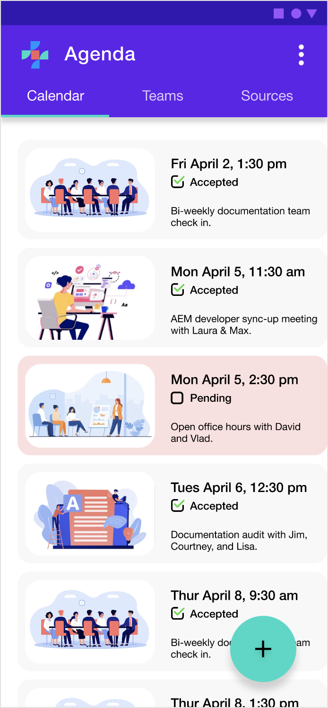
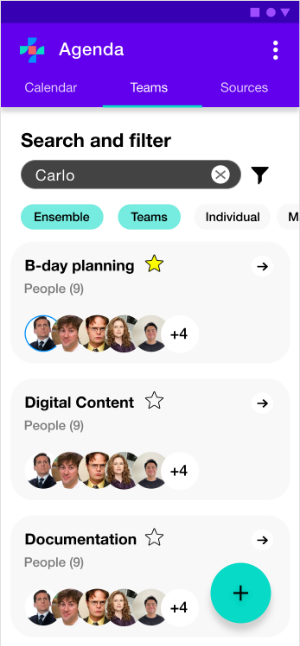
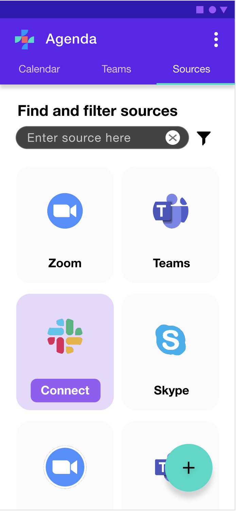
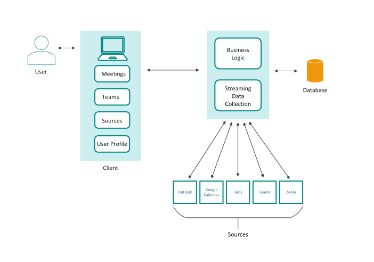

---
# Page settings
layout: default
keywords:
comments: false

# Hero section
title: Agenda Overview Documentation
description: The following guide explains x, y, z.

# Author box
author:
    title: How we write
    title_url: '/ensemble-overview'
    external_url: false
    description: Learn about what goes into making a great overview document.

# Micro navigation (the side navigation in the body)
micro_nav: true

# Page navigation buttons
page_nav:
    prev:
        content: Previous page
        url: '/API'
    next:
        content: Next page
        url: '/UI'
---
<!-- Write the documenation content here -->

# Agenda Application Overview

As remote collaboration becomes even more essential for businesses, the available platforms for scheduling meetings are increasing and gaining in complexity. Agenda streamlines how you manage meetings across platforms and teams by combining team member availability and meeting platforms from separate applications into one workspace. Review upcoming meetings in one clean view and seamlessly schedule meetings with your various teams through a simplified scheduling workflow.

Agenda connects to external scheduling applications like Microsoft Outlook Calendar, Google Calendar, or Zoom and merges their independent meeting data into one place. By consolidating team member availability into one simplified workspace, you can quickly schedule meetings that work well for everyone. Agenda eliminates the cumbersome process of comparing multiple calendars for team members across various applications.

With Agenda, you can:

- Quickly view and schedule meetings.
- Create and manage teams that suit your organizational needs.
- Import calendars and meeting rooms from external applications.
- Connect to your Employee Management System for quick [team onboarding](insert link to Import a Team Tutorial).

**add appropriate links to the above list items for quick access to their associated docs or headings in this doc**

[Get started](insert link to Quick Start Guide) with Agenda and import your first calendar.
  
## How Agenda works

Agenda connects to external calendars and meeting platforms to merge user meeting details into one application, providing a more complete view of team availability and creating a simplified scheduling workflow. With everyone's meeting details available within one space, you can quickly create teams and schedule meetings that work well for all.

Explore Agenda's [user interface](UI.md).

### Quick scheduling

Agenda's home view displays your upcoming meetings and provides quick access to the [scheduling tool](insert link to the Schedule a Meeting tutorial) in one simplified user interface. 

From here, you can select the plus icon to start scheduling a new meeting. Agenda's scheduling workflow walks you through all of the necessary steps to set up a meeting with your team members and suggests recommended times based on everyone's availability.

### Organizing teams

With the teams feature, you can [create teams](insert link to to Create/Join a Team Guide) and organize users based on project assignments, company team structure, or any other team assignment that reflects your organizational needs. Teams are searchable by various tag criteria to help you quickly locate and assign the right people you need on your team. 

When scheduling team meetings you simply have to select the team and all team member availability is assessed to present you with the best meeting times that work for everyone.

### Merging external calendars

Agenda is an API-first application that enables simplified [connections to your external scheduling applications](insert link to Connect to a Source tutorial) using the sources feature. From sources you can choose from a number of scheduling applications to [merge your meeting information](insert link to Import a Meeting tutorial) into one space. 

Agenda unifies this data to provide you, and your team members, with a clearer view of your availability. Meetings scheduled within Agenda can also be pushed to your external scheduling applications to ensure all of your calendars are up to date.

## System architecture

Agenda connects to several external scheduling applications and meeting platforms via APIs to ingest user meeting data. External meeting data is streamed into Agenda for processing and is used to update the meeting data set for a given user profile. Meeting information for each user is stored and used to update availability when scheduling new meetings with teams. The availability of external meeting information from connected sources allows Agenda to suggest the most appropriate meeting times based on each team member's separate schedules.

For detailed information on Agenda's APIs see the [API endpoint reference guides](API.md).

From a high-level Agenda is comprised of:

a) Three main views that allow you to view and schedule meetings, connect to sources, and create and manage your teams.

b) Data collection and business logic layer: Where all of the disparate meeting data for users is combined from external sources to provide a singular view of each users availability. This is where meeting requests are processed, updated, and made available for export back to your connected sources.

c) Database: Where user's updated profile and scheduling data is stored.

d) Agenda is built API-first and can be connected to a wide variety of external scheduling and meeting applications, such as: Google Calendar, Outlook, Slack, Zoom, Teams, and so on. Meeting data is then streamed from the connected source into Agenda to be processed and used to update user availability. Agenda can also be configured to send updated meeting information to selected sources, depending on the availability of their API connectors.

## Learn more

[Quick start guide](insert link)

[Agenda's user interface](UI.md)

[API guides](API.md)

[FAQ](insert link)
