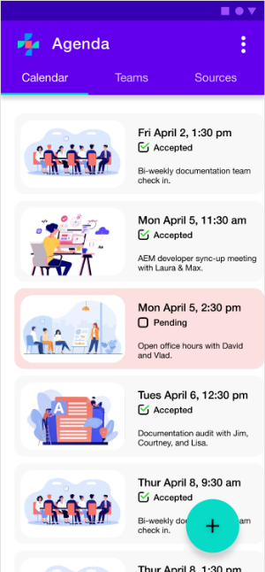
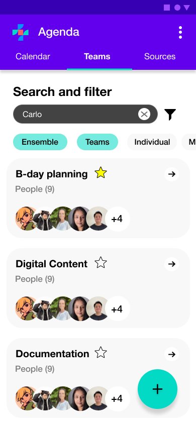
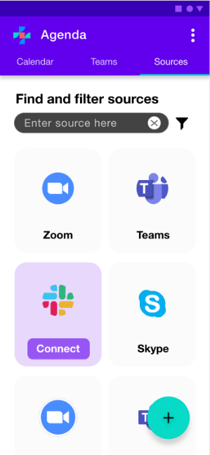

---
# Page settings
layout: default
keywords:
comments: false

# Hero section
title: Agenda Overview Documentation
description: The following guide explains x, y, z.

# Author box
author:
    title: How we write
    title_url: '/ensemble-overview'
    external_url: false
    description: Learn about what goes into making a great overview document.

# Micro navigation (the side navigation in the body)
micro_nav: true

# Page navigation buttons
page_nav:
    prev:
        content: Previous page
        url: '/API'
    next:
        content: Next page
        url: '/UI'
---

# Agenda application overview

As remote collaboration becomes more essential for businesses, the available platforms for scheduling meetings are increasing and gaining in complexity. Agenda streamlines how you manage meetings across platforms and teams by combining team member availability and meeting platforms from separate applications into one workspace. Review upcoming meetings in one clean view and seamlessly schedule meetings with your various teams through a simplified scheduling workflow.

Agenda connects to external scheduling applications such as Microsoft Outlook Calendar, Google Calendar, or Zoom, and merges their independent meeting data into one place. By consolidating team member availability into one simplified workspace, you can quickly schedule meetings that work well for everyone. Additionally, Agenda can assist with finding the right people to add to a meeting. Need a lead developers opinion? No problem, use Agendas built in tag feature to find the right person. Big organization with too many results? Further filter your results by software specialty, organization, teams, and other metadata contained within Agenda.

With Agenda you can:

- Quickly [view, schedule, and reschedule meetings](link-placeholder).
- [Create and manage teams](link-placeholder) that suit your organizational needs.
- [Import calendars and meeting rooms](link-placeholder) from external applications.
- Connect to your Employee Management System for quick [team onboarding](link-placeholder).

Not sure where to begin? visit the [getting started guide](link-placeholder) to learn how to import your first calendar.
  
## How Agenda works

Agenda connects to external calendars and meeting platforms to merge user meeting details into one simplified view, providing a more comprehensive picture of team availability and simplifying the scheduling workflow. With everyone's meeting details available within one space, you can quickly create teams and schedule meetings that work well for all. By using Agenda, you can even create cross-organization teams to further streamline vendor and contract work. No one wants to burn budget and time trying to find a meeting time that works for everyone through multiple messages and emails.

You can manage Agenda's capabilities through the simplified [user interface](UI.md) or integrate Agenda with your external applications using the [RESTful API](API.md).

### Quick scheduling

Agenda's home view displays your upcoming meetings and provides quick access to the [scheduling tool](insert link to the Schedule a Meeting tutorial) in one simplified user interface. 

From here, you can select the add icon () to start scheduling a new meeting. Agenda's scheduling workflow walks you through all of the necessary steps to set up a meeting with your team members and suggests recommended times based on everyone's availability.

### Organizing teams

Agenda allows you to organize your people just as easily as your meeting schedules. You can [create and customize teams](link-placeholder) to organize users based on project assignments, company team structure, or any other team assignment that reflects your organizational needs. Teams are searchable by various tag criteria to help you quickly locate and add the right people to your meetings.

When scheduling team meetings, simply select the team and the availability of all its members is factored in to suggest the ideal meeting times that work best for everyone.

### Merging external calendars

Agenda makes it simple to [connect to your external scheduling applications](link-placeholder) from the Sources tab in the UI. You can choose from several scheduling applications to [merge your meeting information](link-placeholder) into one space. 

Agenda unifies this data to provide you and your team members with a clearer view of each other's availability. 

While Agenda provides an overview of your upcoming schedule from the home screen, meetings scheduled in Agenda can also be pushed to your external scheduling applications to ensure all of your calendars are up to date. This is helpful if you work with external partners or clients who are not set up with Agenda and require access to your availability in a different platform.

## System architecture

Agenda creates a data pipeline that streams real-time data between external calendar applications to ensure that your team's schedules are always aligned.

Agenda connects to several external scheduling applications and meeting platforms to ingest user meeting data. External meeting data is streamed into Agenda for processing, and is used to update the displayed schedules for each user profile in real time. Meeting information for each user is stored and used to update availability when scheduling new meetings with teams. By making external meeting information available through connected sources, Agenda can suggest the most appropriate meeting times based on each team member's separate schedules.

At a high level, Agenda is comprised of the following major components:

- **Three main views**: Allows you to view and schedule meetings, connect to sources, and manage your teams.

- **Data collection and business logic layer**: Where all of the disparate meeting data for users is combined from external sources to provide a singular view of each user's availability. This is where meeting requests are processed, updated, and made available for export back to your connected sources.

- **Database**: User profiles and scheduling data are stored in a secure database partition unique to your organization.

- **Source connectors**: Agenda can be connected to a wide variety of external scheduling and meeting applications, such as Google Calendar, Outlook, Slack, and Zoom. Meeting data is then streamed from the connected source into Agenda to be processed and used to update user availability. Agenda can also be configured to send updated meeting information back to selected sources.

## Learn more

You can get started with Agenda quickly and easily by following along with step-by-step tutorials covering everything from connecting your source calendars to pushing your unified schedule to each external application.

Visit the Agenda [quick start guide](insert-link) or our [user Interface guide](insert-link) to get started.

For information on how to leverage Agenda capabilities for programmatic integrations, visit the Agenda [API guides](API.md). For answers to additional commonly-asked questions, refer to the [FAQ](insert-link).
