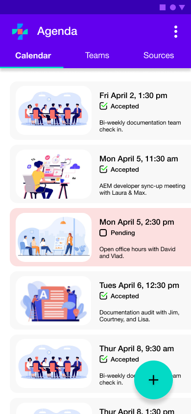
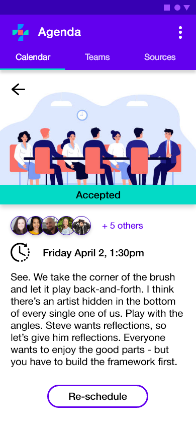

---
# Page settings
layout: default
keywords:
comments: false

# Hero section
title: Agenda User Interface Documentation
description: Learn how to create teams, schedule meetings, and connect your sources.

# Author box
author:
    title: How we write
    title_url: '/ensemble-UI'
    external_url: false
    description: Learn more about how we write UI documenation

# Micro navigation
micro_nav: true

# Page navigation
page_nav:
    prev:
        content: Previous page
        url: '/Overview'
    next:
        content: Next page
        url: '/API'
---

# Agenda mobile app user interface (UI) guide

This tutorial serves as an introduction to using the Agenda IOS and Android Application user interface (UI). For information on the Mac OS or Windows application, visit the [Agenda web app user interface (UI) guide](link-needed).

## Calendar page

Agenda allows data to be ingested from external calendars while providing you with the ability to create, label, sort, and manage meeting data across multiple platforms.

Initially you are greeted with the Agenda Calendar page upon opening the mobile application. The Calendar page displays all your upcoming meetings in order, wether you have accepted the meetings, the time, and a brief description. Additionally, meetings are categorized by a type which determines the image next to the meeting.

Selecting a meeting opens up the detailed view of the proposed meeting. Here you can see the full description and additional attendees. 

### Reschedule a meeting

If by chance you can no longer make a meeting, you also have the option to re-schedule a meeting. Selecting re-schedule opens up the meeting editor where you can suggest a new date/time. Agenda automatically suggests times that work for all folks invited to the meeting, however, you can also choose to select the 'optional' toggle. This makes it so Agenda only suggests times for required individuals.

## Create a new meeting

- Schedule a new meeting from the homepage view by selecting the plus sign widget > New Meeting, and following the provided steps. 

## Teams

- View/search teams (team name and number of members) based off of the selected search/filtering criteria.
- Select a team to expand/view further team details (Team members, roles).
- Search for users/add users to an existing team
- Filter users

### Create a new team

- Give the team a name
- Provide an optional icon for your team
- Provide optional tags/description for your team.
- Add members to your team by searching for names/tags.

## Sources
