# Onboarding guide

The Agenda application connects to external scheduling applications like Microsoft Outlook Calendar, Google Calendar, or Zoom, and merges their independent meeting data into one place. By consolidating team member availability into one simplified workspace, you can quickly schedule meetings that work well for everyone. 

This document guides you through the installation process on your device, creating a new account, and linking an external calendar.

## System requirements

### Windows system requirements

Below are a list of hardware requirements for installing the Agenda application on a Windows machine:

| Component | Requirement |
| --- | --- |
| Operating system | Windows 10 or Windows 11 |
| Processor | Minimum 1.1 GHz |
| Memory | 4.0 GB RAM |
| Hard disk | 3.0 GB of available disk space |

### MacOS system requirements

Below are a list of hardware requirements for installing the Agenda application on a Mac machine:

| Component | Requirement |
| --- | --- |
| Operating system | MacOS Catalina or newer |
| Processor | 2.6 GHz 6-Core Intel Core i7 |
| Memory | 4.0 GB RAM |
| Hard disk | 1.5 GB of available disk space |

## Windows install

The Agenda application is compatible with Windows and is compatible with the Windows 10 and Windows 11 operating systems.

>[!NOTE] 
>
>You can use any web browser to download the app.

To download the Agenda desktop client on Windows:

Navigate to https://www.example.agenda.ca/download-app. This is the official Agenda download site.

Select the **[!UICONTROL Download]** button that corresponds to the operating system you are using, Windows 10 or Windows 11. 

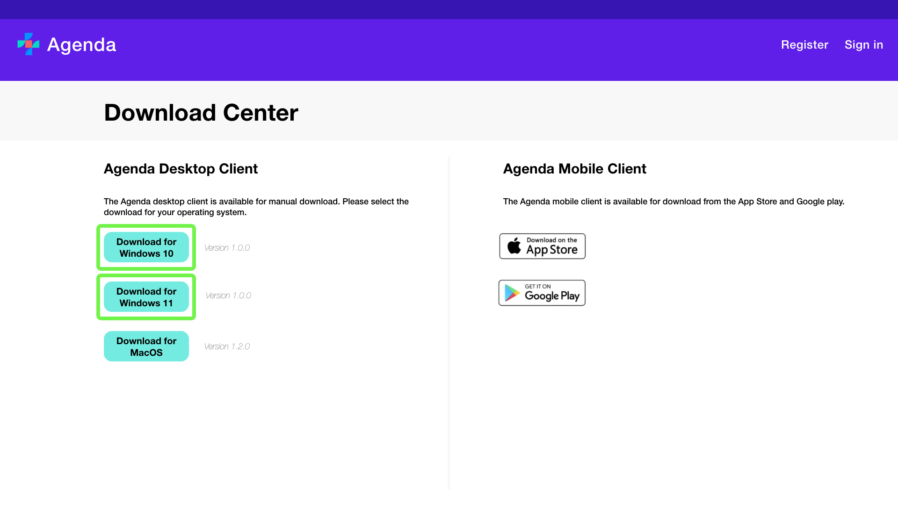

This opens a [!UICONTROL Save as] dialog. Select a location to save the downloaded file and then select **[!UICONTROL Save]**.

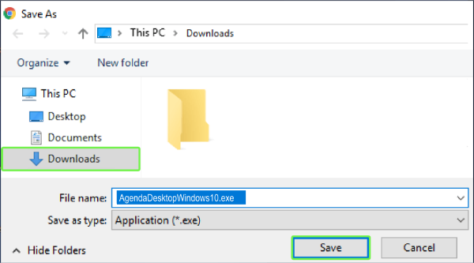

The file is successfully downloaded. Navigate to the download location and select the downloaded installer. 

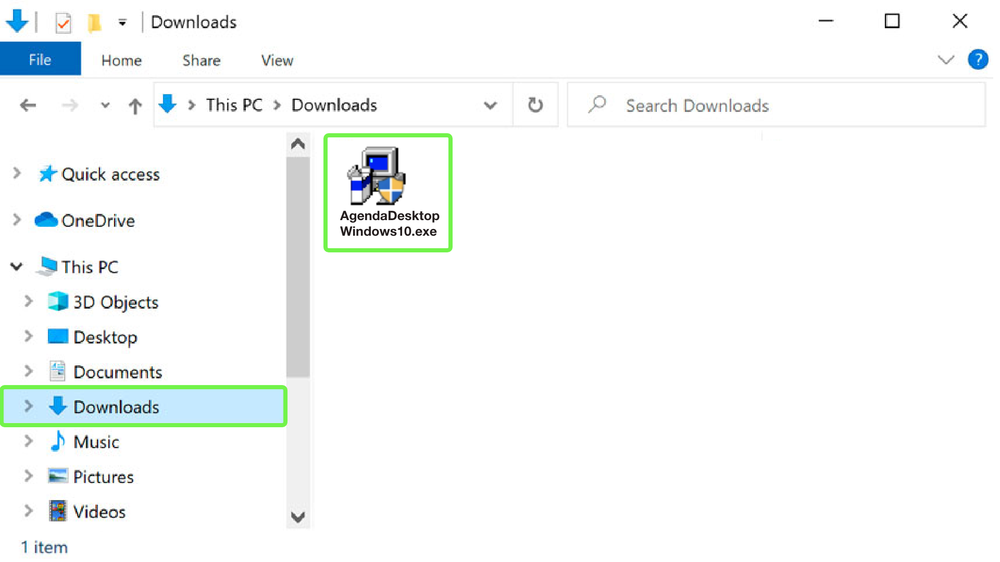

You will be prompted by a [!UICONTROL User Account Control] dialog box requesting access to make changes to your system, select **[!UICONTROL Yes]** to proceed.

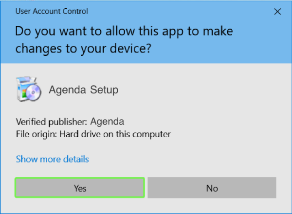

The installation process begins. Allow a few minutes for the installation to complete.

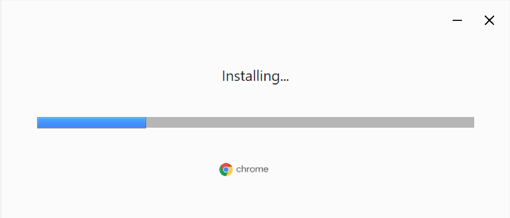

Agenda is successfully installed on the system and a shortcut icon is created on the desktop.

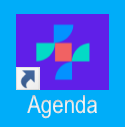

Please see the section on MacOS install for more information on how to download and install the desktop client to a Mac machine.

## MacOS install

The Agenda application is compatible with MacOS and can be installed on the MacOS Catalina and newer operating systems.

>[!NOTE] 
>
>You can use any web browser to download the app.

To download the Agenda desktop client on MacOS:

Navigate to https://www.example.agenda.ca/download-app. This is the official Agenda download site.

Select the **[!UICONTROL Download]** button for MacOS. 

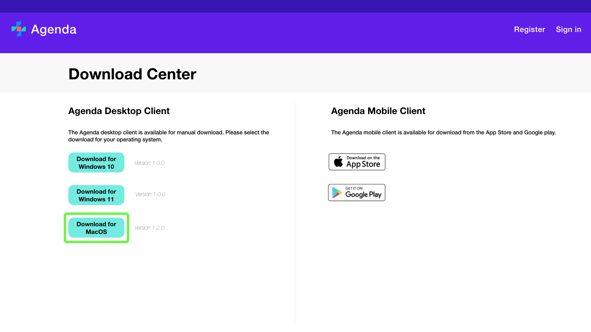

The file is downoaded and saved to your machine.
>[!NOTE]
>
>The default destination for downloads on a Mac is the **Downloads** folder.

Navigate to the Downloads folder and select the downloaded installer.

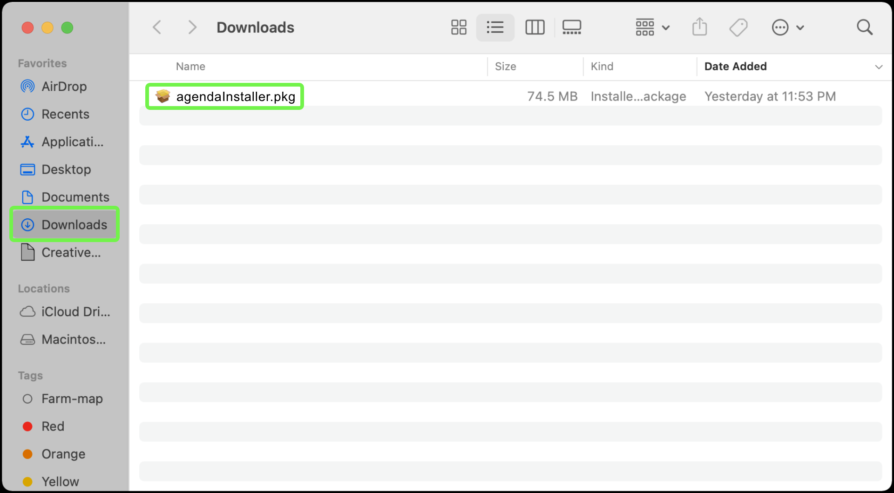

The installer dialog opens the [!UICONTROL Install] dialog on the **Introduction** tab. Select **[!UICONTROL Continue]**.

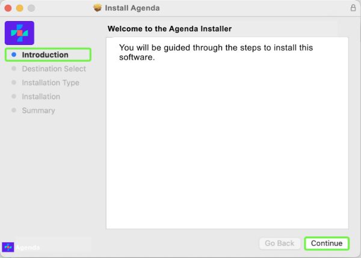

You are taken to the **Installation Type** tab where you can see how much space is required to install the application. Select **[!UICONTROL Install]**.

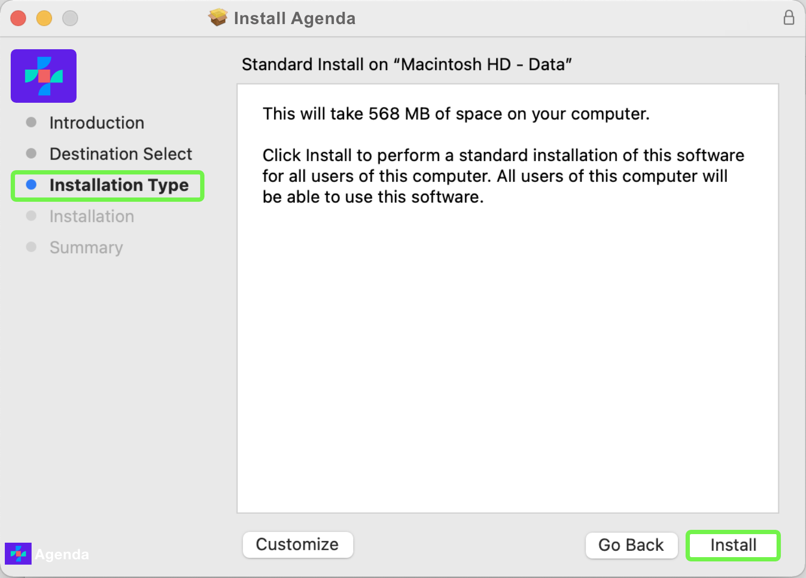

You are presented with the installer credentials dialog box. Enter the administrator credentials (Username and Password) for your device and select **[!UICONTROL Install Software]**.

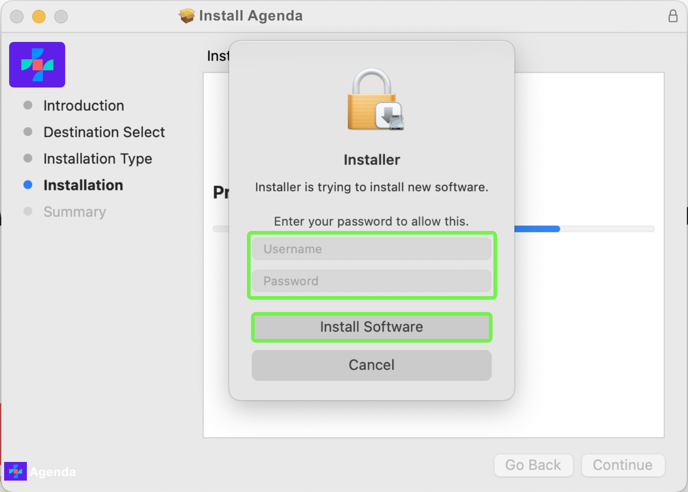

Allow a few minutes for the installation to complete. A dialog appears confirming the installation was successful. Select **[!UICONTROL Close]**.

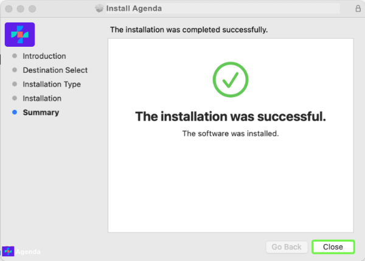

The Agenda app is now available in the **Launchpad**.

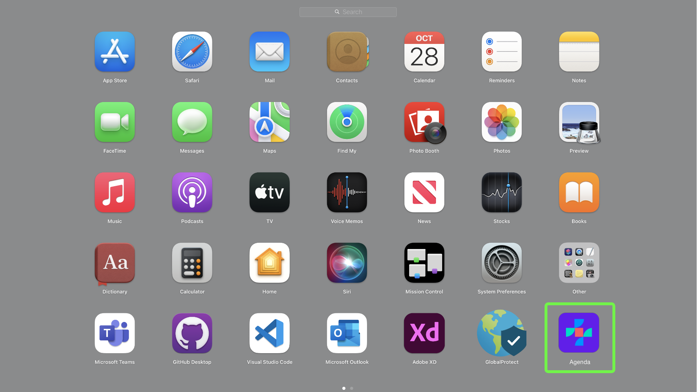

## Create an account

An Agenda account gives you access to many Agenda products. With an Agenda account you can do the following:

* Manage meetings
* Manage teams
* Integrate external calendars
* Manage multiple calendars in one space

To create a new account:

Navigate to the desktop application and select to open. The sign in screen appears. Select **[!UICONTROL Create an account]** on the right side of the screen.

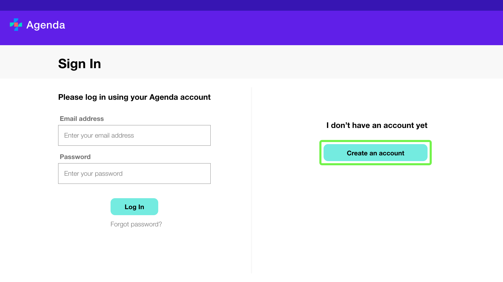

The **[!UICONTROL Create an account]** screen appears. Enter your name, email address, password, and confirm your password. Select **[!UICONTROL Create account]** to complete the account creation process.

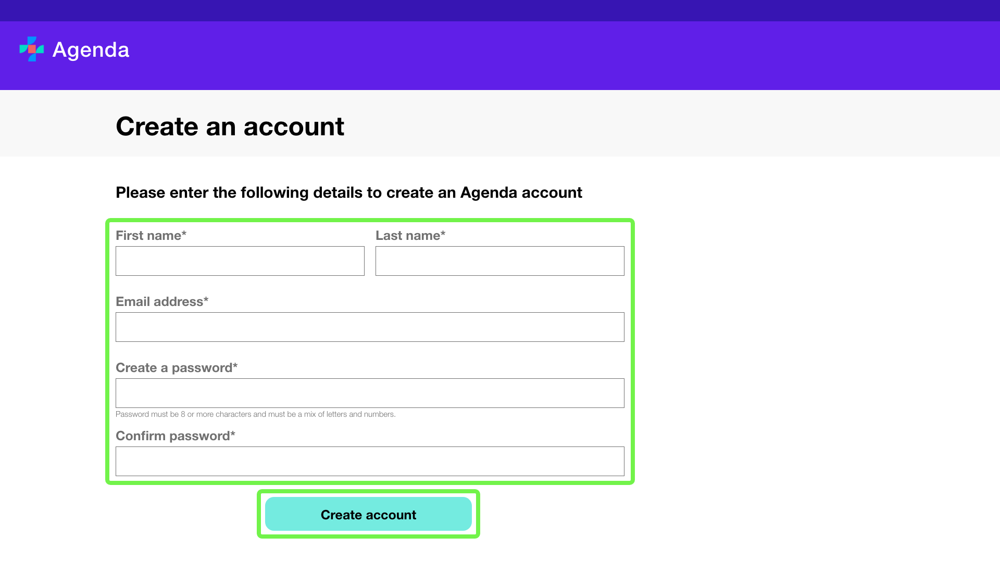

Confirmation of successful account creation appears. Select **[UICONTROL Close]** and you are returned to the **Sign In** screen.

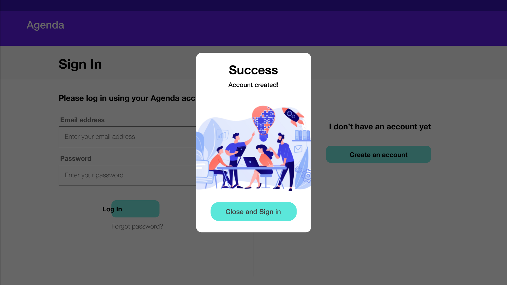

## Integrate an external calendar

In Agenda you can integrate an external calendar allowing you to import and sync events and manage these from a single space.

To integrate an external calendar:

Log into the Agenda application and select the **[!UICONTROL Sources]** tab from the top navigation, then select **[!UICONTROL Add Calendar sources]** from the left navigation.

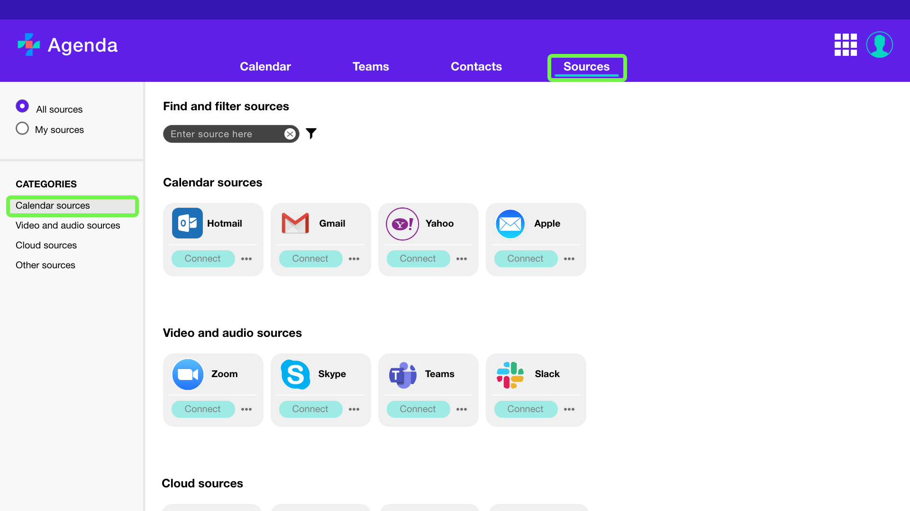

A list of available sources is displayed. Find the service provider for your account and select connect.

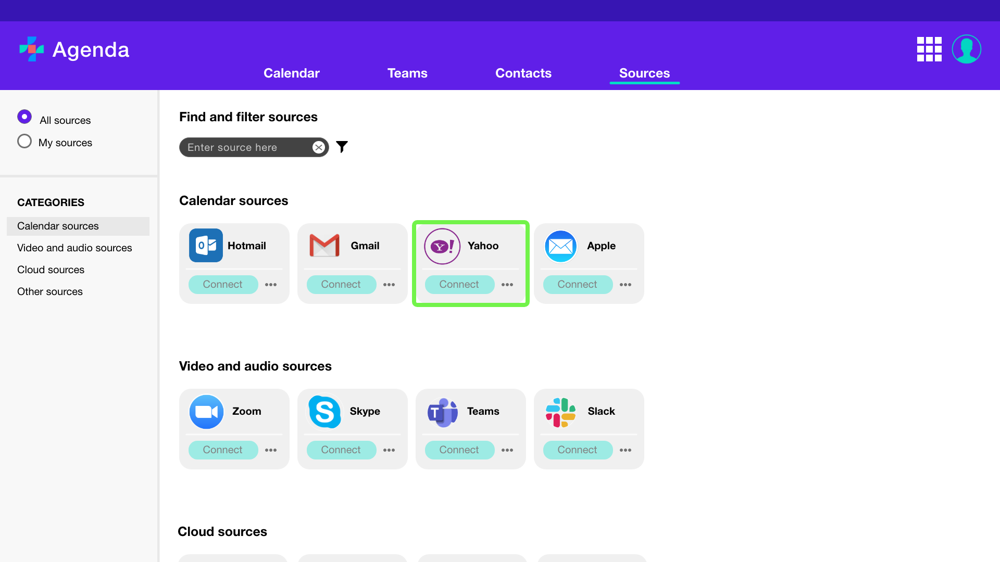

A login dialog appears. Enter your email address and password for the account and then select **[UICONTROL Connect]**.

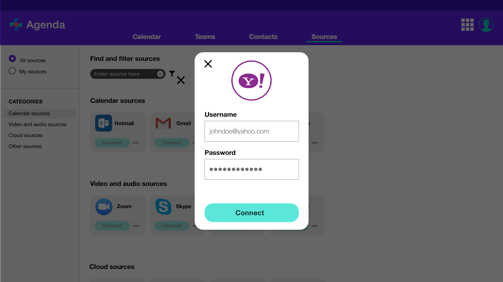

A list of calendars associated with that account appear. Select the calendars that you would like to import by selecting the check box beside the calendars name, the select **[!UICONTROL Import calendars]**.

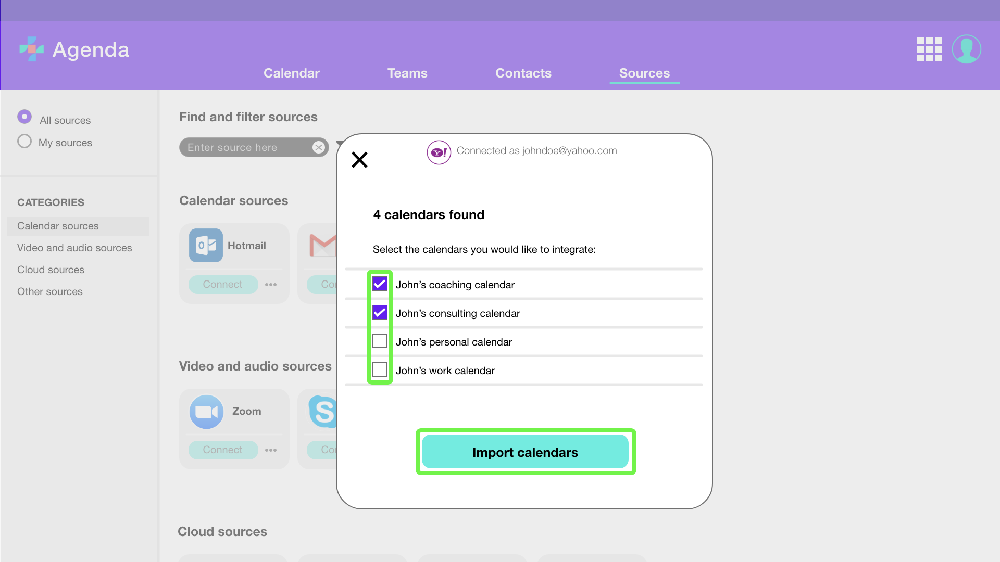

Confirmation of successful import appears. Select **[UICONTROL Close]** and you are returned to the **[!UICONTROL Sources]** tab.

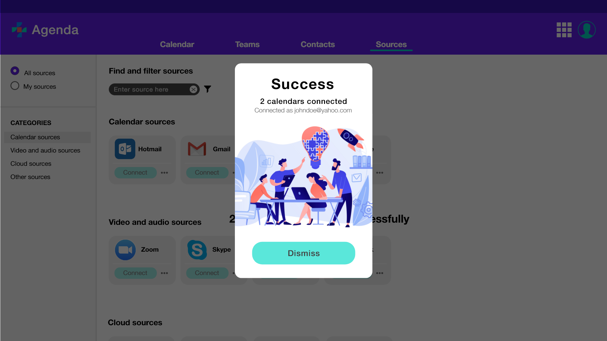

Your calendars will now appear in the **[!UICONTROL Calendar]** tab.

## Next steps

By reading this document, you have successfully downloaded the Agenda desktop client to your machine, created and account, and integrated an external calendar. See the following documents for more information: 

* [Agenda overview](./overview.md).
