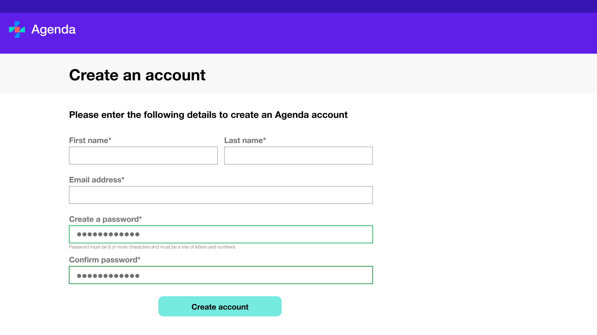
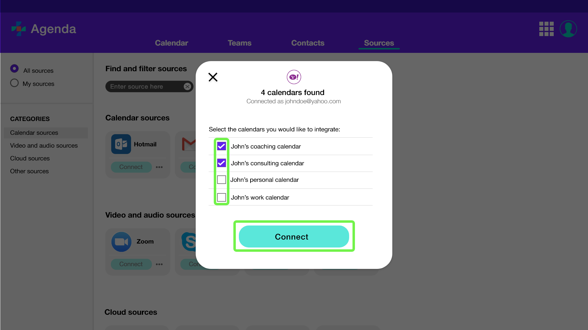

# Onboarding guide

The Agenda application connects to external scheduling applications like Microsoft Outlook Calendar, Google Calendar, or Zoom, and merges their independent meeting data into one place. By consolidating team member availability into one simplified workspace, you can quickly schedule meetings that work well for everyone. 

This document guides you through the installation process on your device, creating a new account, and linking an external calendar.

## System requirements

The sections below outline the system requirements for Agenda depending on whether you are using [Windows] or [MacOS].

### Windows system requirements

Below is a list of hardware requirements for installing the Agenda application on a Windows machine:

| Component | Requirement |
| --- | --- |
| Operating system | Windows 10 or Windows 11 |
| Processor | Minimum 1.1 GHz |
| Memory | 4.0 GB RAM |
| Hard disk | 3.0 GB of available disk space |

### MacOS system requirements

Below are a list of hardware requirements for installing the Agenda application on a Mac machine:

| Component | Requirement |
| --- | --- |
| Operating system | MacOS Catalina or newer |
| Processor | 2.6 GHz 6-Core Intel Core i7 |
| Memory | 4.0 GB RAM |
| Hard disk | 1.5 GB of available disk space |

## Installation

Below are the installation steps for:
* [Windows](#windows)
* [MacOS](#mac)

### Windows install {#windows}

The Agenda application is compatible with the Windows 10 and Windows 11 operating systems.

Using the web browser of your choice, navigate to [the official Agenda download site](https://www.example.agenda.ca/download-app) to download the Agenda desktop client on Windows. This is the official Agenda download site.

Select **[!UICONTROL Download]** under the corresponding section for the operating system you are using (Windows 10 or Windows 11).

This opens a [!UICONTROL Save as] dialog. Select a location to save the downloaded file and then select **[!UICONTROL Save]**.

The file is successfully downloaded. Navigate to the download location and select the installer. 

You will be prompted by a [!UICONTROL User Account Control] dialog box requesting access to make changes to your system. Select **[!UICONTROL Yes]** to proceed.

The installation process begins. Allow a few minutes for the installation to complete.

Agenda is successfully installed on the system and a shortcut icon is created on the desktop.

[Skip ahead to creating an account](#create)

### MacOS install {#mac}

The Agenda application is compatible with MacOS and can be installed on the MacOS Catalina and newer operating systems.

Using the web browser of your choice, navigate to [the official Agenda download site](https://www.example.agenda.ca/download-app) to download the Agenda desktop client on MacOS. This is the official Agenda download site.

Select **[!UICONTROL Download]** under the corresponding section for the MacOS operating system.

The file is downloaded and saved to your machine.

Navigate to the **Downloads** folder (or your alternate downloads folder if you changed the default) and select the installer.

The installer dialog opens. Follow the installer's instructions until you arrive at the Installation step. Enter your administrator details (Username and Password) for your device and select **[!UICONTROL Install Software]**.

Allow a few minutes for the installation to complete. A dialog appears confirming the installation was successful. Select **[!UICONTROL Close]**.

The Agenda app is now available in Launchpad.

[Skip ahead to creating an account](#create)

## Create an account {#create}

An Agenda account gives you access to all of its features. With an Agenda account you can do the following:

* Manage meetings and huddles
* Manage teams
* Integrate external calendars
* Manage multiple calendars in one space

To create a new account, navigate to the desktop application and select to open. On the sign-in screen that appears, select **[!UICONTROL Create an account]**.

Enter your name and email address, then choose a password and confirm that same password before selecting **[!UICONTROL Create account]**.

If successful, you are given confirmation that the account is created. Select **[UICONTROL Close]** and you are returned to the **Sign In** screen.

## Integrate an external calendar

You can integrate external calendars into Agenda, allowing you to import and sync events and manage these from a single space.

To integrate an external calendar, log into the Agenda application and select **[!UICONTROL Sources]** from the top navigation, then select **[!UICONTROL Add Calendar sources]** from the left navigation.

A list of available sources is displayed. Find the service provider for your account and select **[!UICONTROL Connect]**.

Enter your account's email address and password within the login dialog, then select **[UICONTROL Connect]**.

A list of calendars associated with the account appear. Select the check box beside the name of each calendar that you would like to import, then select **[!UICONTROL Import calendars]**.

A message confirms that the calendars have been imported successfully. Select **[UICONTROL Close]** and you are returned to the **[!UICONTROL Sources]** tab.

Your calendars will now appear in the **[!UICONTROL Calendar]** tab, where they can be used to add reminders, schedule meetings, and so on.

## Next steps

By reading this document, you have successfully downloaded the Agenda desktop client to your machine, created an account, and integrated an external calendar. See the following documents for more information: 

* [Agenda overview](./overview.md).
